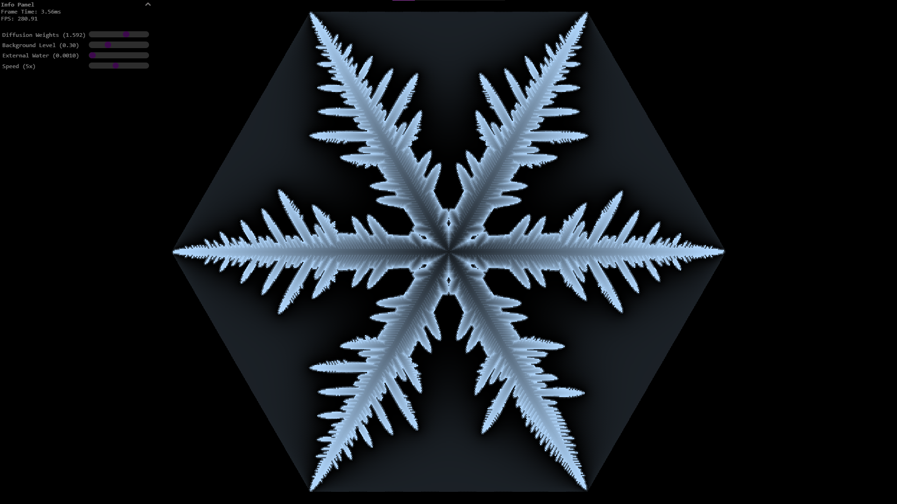

# Procedural Snowflakes

A simple program made with WebGPU to generate and render snowflakes procedurally, based on Reiter's paper "A local cellular model for snow crystal growth"

# References

- https://doi.org/10.1016/j.chaos.2004.06.071
- https://www.redblobgames.com/grids/hexagons
